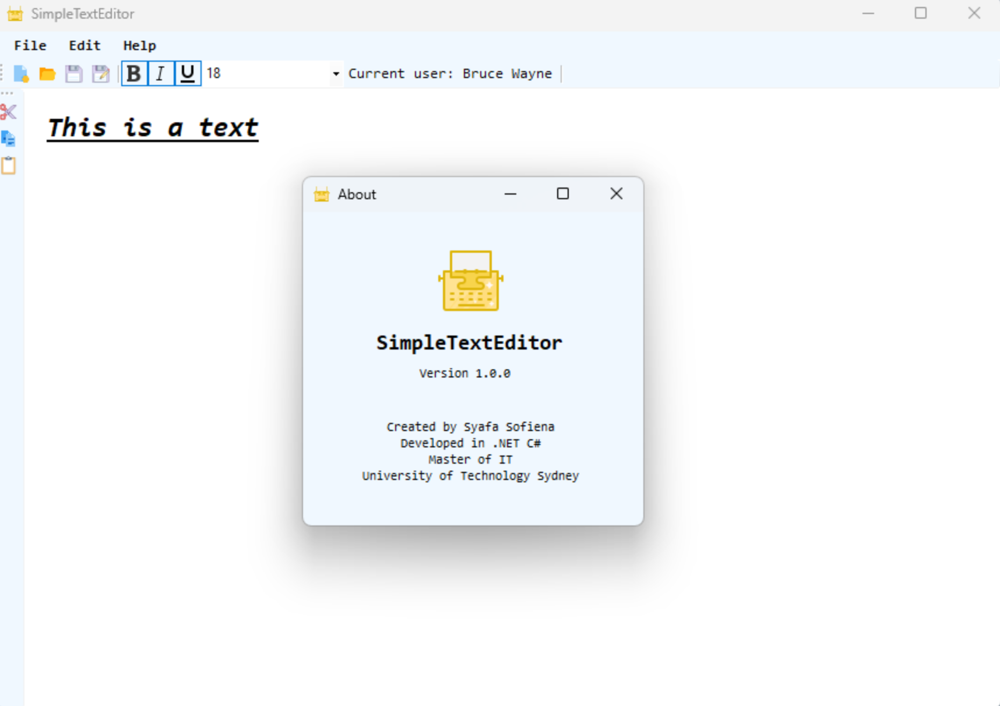

# SimpleTextEditor

⌨️A rich text editor developed as part of a C#/.NET Framework programming assignment at the University of Technology Sydney (UTS), Faculty of Engineering and Information Technology, School of Computer Science.

## How to Run
1. Ensure your Windows environment is set up to run .NET applications.
2. Clone repo or download and unzip the provided project folder.
3. Run the aoo through Visual Studio or by executing the compiled executable directly.

## Features
- Login and user registration system
- Rich text editing capabilities including font styling and size adjustment
- File management options (New, Open, Save, Save As)
- User type-based access control for document editing (View, Edit)
